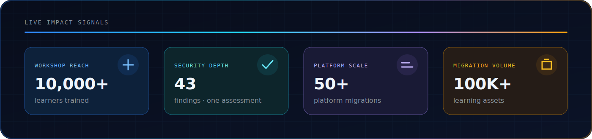
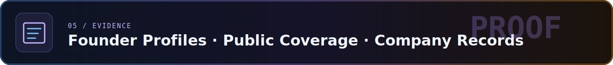
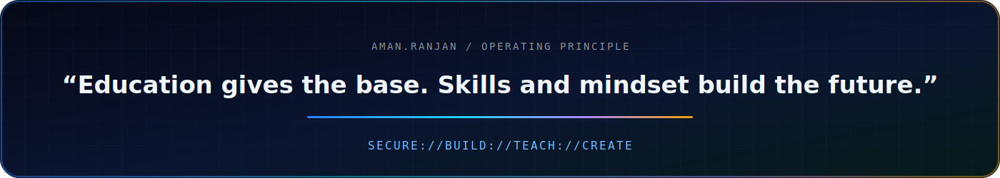

<picture>
  <source media="(max-width: 600px)" srcset="./assets/hero-mobile.svg">
  
</picture>

 

 

&nbsp;&nbsp;&nbsp;

 

<b>PERSONAL IDENTITY</b> × <b>COMPANY MISSION</b>

 

<picture>
  <source media="(max-width: 600px)" srcset="./assets/impact-mobile.svg">
  
</picture>

> **Operating at the intersection of secure software, applied AI, and practical technology education.** Every security engagement, enforcement workflow, and platform migration referenced below was authorized professional work.

 

<picture>
  <source media="(max-width: 600px)" srcset="./assets/section-secure-mobile.svg">
  
</picture>

### Selected security engagements

- **EduCrypt — LMS Admin Panel:** Static and dynamic assessment produced **43 findings**, including **20 Critical** and **15 High**.
- **CloudBuddy:** Platform security audit identified **25 vulnerabilities**.
- **ABP Live:** Infrastructure assessment delivered with prioritized remediation guidance.
- **Exampur · Waves App · Motion (Kota):** API, access-control, abuse-case, and business-logic testing.

<b>Open the AppSec methodology</b>

 

`Static analysis` → `Dynamic testing` → `API abuse cases` → `Authorization review` → `Business-logic testing` → `Prioritized remediation`

- Web, platform, and API assessment
- Unauthorized-access vector identification
- Secure SDLC and threat-model thinking
- Professional HTML reporting with actionable fixes

<b>Open digital-content protection operations</b>

 

Designed and operated authorized copyright-enforcement workflows across Telegram, YouTube, and websites, including **250+ Telegram channel takedowns**.

 

<picture>
  <source media="(max-width: 600px)" srcset="./assets/section-build-mobile.svg">
  
</picture>

### Flagship build — [Developer Vault](https://github.com/amanranjan26262626-creator/Developer-Vault)

> A local-first Chrome Manifest V3 debugging extension that turns browser activity into reproducible engineering evidence.

<b>What Developer Vault captures</b>

 

- API requests and responses, WebSocket traffic, storage, and IndexedDB
- JWT decoding, cURL generation, page-source capture, and request replay context
- HAR, JSON, and ZIP exports for debugging and evidence sharing
- JavaScript, HTML, Chrome Debugger / DevTools Protocol APIs, and JSZip

### Applied AI surface

- **AI Playground:** Prompt Lab, Code Assistant, Model Compare, and Image Studio in one practical learning environment.
- **LLM applications:** Prompt engineering, evaluation workflows, AI-assisted development, and automation concepts.
- **Cybercrime Reporting Portal:** A multi-stack architecture prototype exploring Next.js, TypeScript, Solidity, PostgreSQL, MongoDB, Gemini, IPFS, Firebase, and Hyperledger concepts.

 

<picture>
  <source media="(max-width: 600px)" srcset="./assets/section-found-mobile.svg">
  
</picture>

### Founder & Director — LACSA TECH

*LACSA TECH positions itself as “India's First AI Startup Institute.”*

The journey began with free technology classes under **LiveAllClass in 2023**, evolved into an AI and cybersecurity education initiative, and became **LACSA TECH Private Limited in 2025**.

- **10,000+ learners trained through workshops**
- **AI Career Program:** AI fundamentals, prompt engineering, automation, project work, and startup thinking
- **Ethical Hacking Program:** penetration testing, network and web security, bug-bounty concepts, and hands-on tooling
- **Founder-first learning:** helping students move from consuming technology to building solutions

> “Education gives the base. Skills and mindset build the future.”

 

<picture>
  <source media="(max-width: 600px)" srcset="./assets/section-scale-mobile.svg">
  
</picture>

### Platform and content operations

- **50+ platform migrations** across learning ecosystems
- **100,000+ learning assets** migrated with mapping, structure, and integrity controls
- High-volume workflows spanning ClassPlus, AppX, YouTube, CareerWill, Graphy, Google Drive, and custom learning platforms

<b>Open the delivery map</b>

 

- **ClassPlus:** 30+ authorized migrations with content extraction and structured uploads
- **AppX:** 20+ authorized platform migrations across multiple delivery formats
- **YouTube:** 30,000+ videos migrated, structured, and mapped
- **CareerWill:** 70,000+ videos migrated
- **Graphy:** Structured migration from a custom protected environment
- **Edugorilla · Shri Ram IAS:** End-to-end content restructuring and transfer
- **Google Drive:** High-volume extraction pipelines with data-integrity controls

 

<picture>
  <source media="(max-width: 600px)" srcset="./assets/section-evidence-mobile.svg">
  
</picture>

### Founder profiles

### Coverage and company records

<b>Source note</b>

 

National Law Review hosts an EIN Presswire release, while Dailyhunt carries a Tycoon World story. They are linked as public coverage—not represented as independent technical validation. Company incorporation and Aman Ranjan's Director role are separately supported by public company records.

---

## Technical operating stack

**Security**

`Application Security` · `VAPT` · `API Security` · `Secure SDLC` · `Threat Modelling` · `Business-Logic Testing`

**AI**

`LLM Applications` · `Prompt Engineering` · `Model Evaluation` · `AI Automation` · `Gemini`

**Engineering**

---

<picture>
  <source media="(max-width: 600px)" srcset="./assets/footer-mobile.svg">
  
</picture>

 

 

