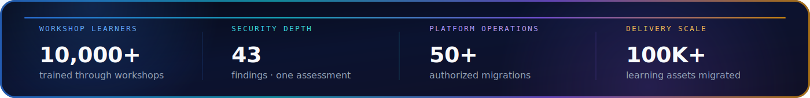

<picture>
  <source media="(max-width: 768px)" srcset="./assets/hero-mobile.svg?v=2">
  
</picture>

 

 

SECURE SOFTWARE · APPLIED AI · FOUNDER-FIRST EDUCATION · PLATFORM OPERATIONS

 

> I build secure systems, practical AI products, and technology education that turns learners into builders. All security engagements and platform operations referenced here were authorized professional work.

<picture>
  <source media="(max-width: 768px)" srcset="./assets/impact-premium-mobile.svg">
  
</picture>

 

## 01 — Security Engineering

APPLICATION SECURITY · API SECURITY · VAPT · SECURE SDLC · BUSINESS-LOGIC TESTING

### Selected authorized engagements

- **EduCrypt — LMS Admin Panel:** static and dynamic assessment produced **43 findings**, including **20 Critical** and **15 High**.
- **CloudBuddy:** platform security audit identified **25 vulnerabilities**.
- **ABP Live:** infrastructure assessment delivered with prioritized remediation guidance.
- **Exampur · Waves App · Motion (Kota):** API, access-control, abuse-case, and business-logic testing.

<b>Application-security methodology</b>

 

`Reconnaissance` · `Threat modelling` · `Authentication` · `Authorization` · `Session security` · `Input validation` · `API abuse cases` · `Business logic` · `Reporting` · `Remediation validation`

<b>Digital-content protection operations</b>

 

- **250+ Telegram channels and groups** actioned through documented takedown workflows.
- Evidence capture, ownership verification, escalation tracking, and closure validation.
- Platform-abuse investigation designed around authorization, auditability, and responsible handling.

## 02 — AI & Product Engineering

LLM APPLICATIONS · AUTOMATION · DEVELOPER TOOLS · EXPERIMENTAL SYSTEMS

### [Developer Vault](https://github.com/amanranjan26262626-creator/Developer-Vault) — flagship build

A local-first Chrome Manifest V3 debugging extension that turns browser activity into reproducible engineering evidence.

<b>What Developer Vault captures</b>

 

- API requests and responses, WebSocket traffic, storage, and IndexedDB.
- JWT decoding, cURL generation, page-source capture, and request replay context.
- HAR, JSON, and ZIP exports for debugging and evidence sharing.
- JavaScript, HTML, Chrome Debugger / DevTools Protocol APIs, and JSZip.

### Applied AI surface

- **AI Playground:** Prompt Lab, Code Assistant, Model Compare, and Image Studio in one practical learning environment.
- **LLM applications:** prompt engineering, model evaluation, AI-assisted development, and automation concepts.
- **[Cybercrime Reporting Portal](https://github.com/amanranjan26262626-creator/cybercrime-portal):** an architecture prototype exploring Next.js, TypeScript, Solidity, PostgreSQL, MongoDB, Gemini, IPFS, Firebase, and Hyperledger concepts.

## 03 — Founder & Director · LACSA TECH

INDIA'S FIRST AI STARTUP INSTITUTE · AI & CYBERSECURITY EDUCATION

LACSA TECH is positioned as **“India's First AI Startup Institute”**, focused on practical AI, cybersecurity, startup thinking, and founder-first learning.

- **10,000+ learners trained through workshops.**
- **AI Career Program:** AI fundamentals, prompt engineering, automation, project work, and startup thinking.
- **Ethical Hacking Program:** penetration testing, network and web security, bug-bounty concepts, and hands-on tooling.
- **Founder-first learning:** helping students move from consuming technology to building real solutions.

[Explore LACSA TECH](https://lacsa.tech/) · [Watch on YouTube](https://www.youtube.com/@lacsatech)

## 04 — Migration Operations

INDEPENDENT DELIVERY & PLATFORM OPERATIONS · SEPARATE FROM LACSA TECH

- **50+ platform migrations** across learning ecosystems.
- **100,000+ learning assets** migrated with mapping, structure, and integrity controls.
- High-volume workflows spanning **ClassPlus, AppX, YouTube, CareerWill, Graphy, Google Drive**, and custom learning platforms.

<b>Open the delivery map</b>

 

- **ClassPlus:** 30+ authorized migrations with content extraction and structured uploads.
- **AppX:** 20+ authorized platform migrations across multiple delivery formats.
- **YouTube:** 30,000+ videos migrated, structured, and mapped.
- **CareerWill:** 70,000+ videos migrated.
- **Graphy:** structured migration from a custom protected environment.
- **Edugorilla · Shri Ram IAS:** end-to-end content restructuring and transfer.
- **Google Drive:** high-volume extraction pipelines with data-integrity controls.

## 05 — Public Footprint

### Founder profiles

[Crunchbase](https://www.crunchbase.com/person/aman-ranjan-f137) · [Knowlepedia](https://knowlepedia.org/wiki/Aman_Ranjan) · [LinkedIn](https://www.linkedin.com/in/amanranjan2626)

### Coverage & company records

[WEM India](https://wemindia.com/from-small-town-jharkhand-to-indias-ai-frontier-20-year-old-founder-builds-startup-focused-tech-institute/amp/) · [National Law Review](https://natlawreview.com/press-releases/jharkhand-entrepreneur-launches-indias-first-ai-startup-institute-age-20) · [Dailyhunt](https://m.dailyhunt.in/news/india/english/tycoon+world-epaper-dh4c6a646b987d48f5b87f17d40865f089/a+19yearold+from+jharkhand+is+inspiring+indias+youth+to+become+selfreliant-newsid-dh4c6a646b987d48f5b87f17d40865f089_91081650b41311f0b0bedfeccf9a1d95?sm=Y) · [Company Record](https://www.tofler.in/lacsa-tech-private-limited/company/U85499JH2025PTC024841)

<b>Source note</b>

 

Knowlepedia is an open biography page. The National Law Review link hosts a syndicated press release, and Dailyhunt republishes Tycoon World coverage. These links document the public footprint; company status is linked separately through the company record.

## Technical Stack

**Security**  
`Application Security` · `VAPT` · `API Security` · `Secure SDLC` · `Threat Modelling` · `Business-Logic Testing`

**AI**  
`LLM Applications` · `Prompt Engineering` · `Model Evaluation` · `AI Automation` · `Gemini`

**Engineering**  
`TypeScript` · `JavaScript` · `React` · `Next.js` · `Node.js` · `PostgreSQL` · `MongoDB` · `Solidity` · `Chrome Extensions` · `IPFS`

### Education gives the base. Skills and mindset build the future.

[LinkedIn](https://www.linkedin.com/in/amanranjan2626) · [Website](https://lacsa.tech/) · [YouTube](https://www.youtube.com/@lacsatech) · [Email](mailto:amanranjan26262626@gmail.com)

 

