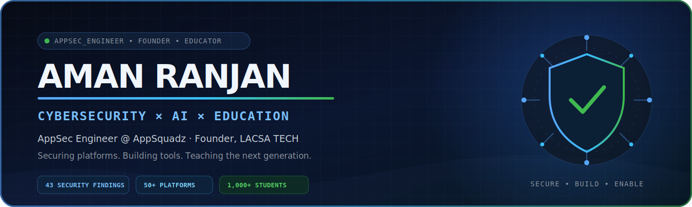

 

 

<table>
<tr>
<td width="52%" valign="top">

### Cybersecurity, AppSec and AI expert.

I work across cybersecurity, application security, and applied AI—combining offensive security thinking with practical AI engineering. I turn technical findings into clear remediation paths and ideas into usable systems.

`Cybersecurity` · `Application Security` · `Applied AI` · `LLM Systems`

</td>
<td width="48%" valign="top">

### Founder and educator by mission.

Founder of **[LACSA TECH](https://www.lacsa.tech)**, building practical AI and cybersecurity education from Tier-3 Jharkhand. Teaching free-first since 2023, with **1,000+ live students** reached.

`AI Education` · `Product Building` · `Community` · `Mentorship`

</td>
</tr>
</table>

### Impact, not noise.

| **43** | **50+** | **100,000+** | **1,000+** |
| :---: | :---: | :---: | :---: |
| Findings in one LMS assessment | Platforms migrated | Videos migrated | Live students taught |

### Featured, profiled and covered.

| Founder profiles | Editorial coverage |
| --- | --- |
| [**Crunchbase** — Founder profile](https://www.crunchbase.com/person/aman-ranjan-f137) [**Knowlepedia** — Biography](https://knowlepedia.org/wiki/Aman_Ranjan) | [**The National Law Review** — India's First AI Startup Institute](https://natlawreview.com/press-releases/jharkhand-entrepreneur-launches-indias-first-ai-startup-institute-age-20) [**World Economic Magazine India** — From Jharkhand to India's AI Frontier](https://wemindia.com/from-small-town-jharkhand-to-indias-ai-frontier-20-year-old-founder-builds-startup-focused-tech-institute/amp/) [**Dailyhunt / Tycoon World** — Inspiring India's Youth to Become Self-Reliant](https://m.dailyhunt.in/news/india/english/tycoon+world-epaper-dh4c6a646b987d48f5b87f17d40865f089/a+19yearold+from+jharkhand+is+inspiring+indias+youth+to+become+selfreliant-newsid-dh4c6a646b987d48f5b87f17d40865f089_91081650b41311f0b0bedfeccf9a1d95?sm=Y) |

> All security assessments, enforcement work, and platform migrations referenced below were authorized professional engagements.

---

## 01 / Secure

### Application security and VAPT

Platform, API, and business-logic testing across EdTech, media, and cloud-infrastructure environments.

| Engagement | Scope | Outcome |
| --- | --- | --- |
| **EduCrypt — LMS Admin Panel** | Static and dynamic admin-panel assessment | **43 findings** — 20 Critical, 15 High |
| **CloudBuddy** | Platform security audit | **25 vulnerabilities** identified |
| **ABP Live** | Infrastructure security audit | Professional assessment and remediation report delivered |
| **Exampur · Waves App · Motion (Kota)** | API analysis and business-logic testing | Access-control, API-abuse, and workflow flaws identified and remediated |

**Method**

`Static analysis` → `Dynamic testing` → `API abuse cases` → `Business-logic review` → `Prioritized remediation`

### Copyright enforcement operations

Designed and operated authorized takedown workflows across **250+ Telegram channels**, YouTube, and websites.

---

## 02 / Build

### LACSA TECH

> An AI and cybersecurity education startup founded in Jhumri Telaiya, Jharkhand—DPIIT / Startup India-recognized and positioned as **“India's First AI Startup Institute.”**

### Applied AI expertise

Built **AI Playground**, a practical multi-tool environment that brings together a Prompt Lab, Code Assistant, Model Compare, and Image Studio.

`LLM Applications` · `Prompt Engineering` · `Model Evaluation` · `AI Automation` · `AI-assisted Development`

---

## 03 / Scale

### EdTech platform engineering

Since February 2024, led authorized content and platform migration work across high-volume learning ecosystems.

| Platform | Delivery |
| --- | --- |
| **ClassPlus** | 30+ migrations with authorized content extraction and structured uploads |
| **AppX** | 20+ migrations, including authorized UHS workflows (v1–v5) |
| **YouTube** | 30,000+ videos migrated, structured, and mapped |
| **CareerWill** | 70,000+ videos migrated |
| **Graphy** | Authorized migration from a custom DRM-protected environment |
| **Edugorilla · Shri Ram IAS** | End-to-end migration with content restructuring |
| **Google Drive** | High-volume extraction pipelines with data-integrity controls |

---

## 04 / Ship

### [Developer Vault](https://github.com/amanranjan26262626-creator/Developer-Vault)

> A local-first Chrome debugging extension that brings network, storage, token, source, and export tooling into one focused workspace.

| Developer workflow | Engineering decision |
| --- | --- |
| Capture API calls and WebSocket traffic | Chrome Manifest V3 architecture |
| Inspect browser storage and decode JWTs | Local-first; no hosted backend |
| Generate cURL commands and HAR exports | Reproducible debugging evidence |
| Capture page sources | Built independently, end to end |

---

## Capabilities

**Security**

`Application Security` · `VAPT` · `API Security` · `Secure SDLC` · `Threat Modelling` · `Business-Logic Testing`

**Artificial intelligence**

`Applied AI` · `LLM Applications` · `Prompt Engineering` · `Model Evaluation` · `AI Automation`

**Engineering**

---

## GitHub activity

---

### Secure deeply. Build intelligently. Create meaningful impact.

